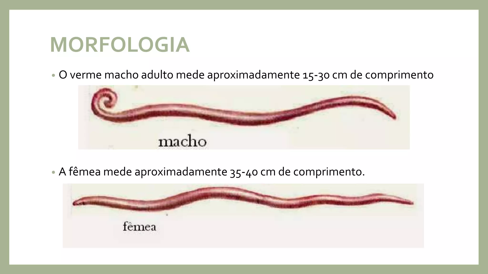
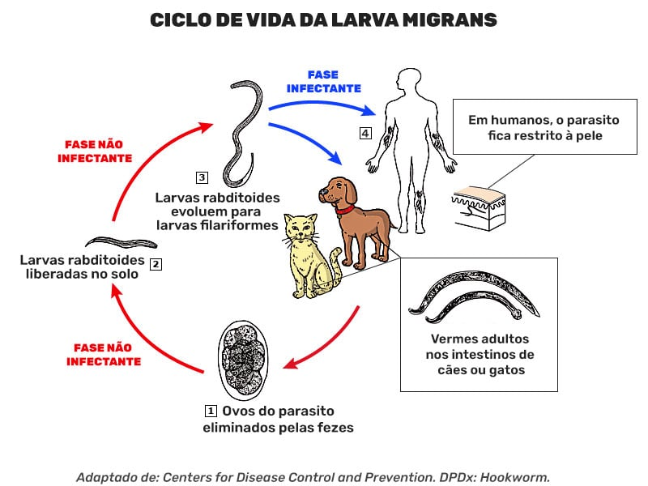

    body {
      font-family: Arial, sans-serif;
      line-height: 1.6;
      margin: 0;
      padding: 0;
      background-color: #f9f9f9;
      color: #333;
    }
    .container {
      max-width: 900px;
      margin: auto;
      padding: 20px;
    }
    h1, h2 {
      color: #2c3e50;
    }
    img {
      max-width: 100%;
      height: auto;
      border-radius: 8px;
      margin-bottom: 15px;
    }
    figure {
      margin: 0 0 25px 0;
    }
    figcaption {
      font-size: 0.9em;
      color: #555;
      text-align: center;
    }
    ul {
      list-style-type: disc;
      margin-left: 20px;
    }
  </style>
</head>
<body>
  

    <h1>Projeto Nematoda: Vida e Impacto</h1>

    

      Este projeto tem como objetivo criar um produto digital que sirva de material educativo sobre o
      <strong>Filo Nematoda</strong>. O site apresenta de forma organizada e acessível
      informações essenciais sobre a diversidade, a morfologia, o ciclo de vida, as doenças associadas
      e as formas de prevenção relacionadas a esses animais.
    

    <h2>Sobre o Filo Nematoda</h2>
    

      Os nematódeos são vermes cilíndricos alongados que apresentam simetria bilateral e
      são revestidos por uma cutícula resistente. São encontrados em praticamente todos os
      ambientes da Terra, com milhares de espécies descritas, desde organismos de vida
      livre essenciais para a decomposição de matéria orgânica até parasitas de plantas e animais.
    

    <figure>
      
      <figcaption>
        Dimorfismo sexual em <em>Ascaris lumbricoides</em> (macho e fêmea de comprimentos diferentes).
      </figcaption>
    </figure>
    

      A espécie <em>Ascaris lumbricoides</em>, conhecida como lombriga, apresenta dimorfismo sexual evidente: os
      machos são menores e possuem a extremidade posterior curvada, enquanto as fêmeas são maiores e possuem
      extremidade reta. Além disso, os nematódeos se caracterizam por um sistema digestório completo (boca
      e ânus) e um sistema reprodutor complexo.
    

    <h2>Doenças Causadas por Nematódeos</h2>
    

      Diversas espécies de nematódeos parasitam seres humanos, causando doenças conhecidas como helmintíases.
      A seguir, são apresentadas as principais enfermidades abordadas no projeto, acompanhadas de seus ciclos de vida.
    

    <h3>Ascaridíase</h3>
    

      A ascaridíase é causada pela lombriga <em>Ascaris lumbricoides</em>. A infecção ocorre pela ingestão
      de ovos presentes em água ou alimentos contaminados. Após eclodirem no intestino, as larvas realizam
      uma migração complexa pelo organismo até retornarem ao intestino delgado, onde se tornam adultas e se reproduzem.
    

    <figure>
      
      <figcaption>
        Ciclo de vida da ascaridíase: ingestão de ovos, migração das larvas pelo corpo e retorno ao intestino.
      </figcaption>
    </figure>

    <h3>Ancilostomíase (Amarelão)</h3>
    

      Conhecida popularmente como amarelão, a ancilostomíase é provocada por vermes
      <em>Ancylostoma duodenale</em> e <em>Necator americanus</em>. As larvas presentes no solo penetraram
      pela pele (geralmente dos pés descalços), alcançam a circulação sanguínea, migram para os pulmões e retornam
      ao intestino, onde atingem a fase adulta.
    

    <figure>
      
      <figcaption>
        Ciclo da ancilostomíase: penetração cutânea, migração sistêmica e desenvolvimento no intestino.
      </figcaption>
    </figure>

    <h3>Larva Migrans Cutânea</h3>
    

      A larva migrans cutânea é causada por larvas de nematódeos de cães e gatos que, ao
      penetrarem a pele humana, provocam lesões serpiginosas. O parasita não completa seu ciclo em humanos e permanece
      restrito à pele.
    

    <figure>
      
      <figcaption>
        Ciclo da larva migrans cutânea: ovos eliminados nas fezes de animais, larvas no solo e infecção acidental em humanos.
      </figcaption>
    </figure>

    <h3>Filariose (Elefantíase)</h3>
    

      A filariose linfática é transmitida pela picada de mosquitos que hospedam as larvas de vermes como
      <em>Wuchereria bancrofti</em>. As larvas desenvolvem-se no interior do mosquito e são inoculadas durante a picada,
      instalando-se nos vasos linfáticos humanos. A obstrução desses vasos causa inchaços crônicos conhecidos
      como elefantíase.
    

    <figure>
      
      <figcaption>
        Ciclo da filariose: produção de larvas pelos vermes adultos, transmissão via mosquitos e desenvolvimento no ser humano.
      </figcaption>
    </figure>

    <h3>Oxiurose</h3>
    

      A oxiurose (enterobiose) é causada pelo nematódeo <em>Enterobius vermicularis</em>. Os ovos são ingeridos ou inalados
      acidentalmente, eclodem no intestino delgado e os adultos alojam-se no ceco. As fêmeas grávidas migram para a região
      perianal durante a noite para depositar seus ovos, provocando intenso prurido.
    

    <figure>
      
      <figcaption>
        Ciclo da oxiurose: ingestão de ovos, eclosão e maturação no intestino e deposição de ovos na região perianal.
      </figcaption>
    </figure>

    <h2>Prevenção e Controle</h2>
    

      A melhor estratégia contra as helmintíases é a prevenção. Medidas simples podem interromper os ciclos de transmissão
      dos nematódeos parasitas:
    

    <ul>
      <li>Melhoria do saneamento básico, com coleta e tratamento de esgoto e abastecimento de água potável;</li>
      <li>Higiene pessoal e limpeza adequada de alimentos;</li>
      <li>Uso de calçados para evitar a penetração de larvas pelo solo;</li>
      <li>Vermifugação de cães e gatos para reduzir o risco de larva migrans;</li>
      <li>Campanhas de desparasitação em massa e educação sanitária em áreas endêmicas.</li>
    </ul>
    <figure>
      
      <figcaption>
        Saneamento básico: abastecimento de água potável, coleta e tratamento de esgoto, limpeza urbana e drenagem de águas pluviais.
      </figcaption>
    </figure>

    <h2>Créditos</h2>
    

      As imagens utilizadas neste projeto foram coletadas de materiais educativos e fontes abertas. Sempre que possível,
      mencionamos a origem e autores das figuras. Recomenda-se consultar os sites originais para informações detalhadas
      e atualizadas sobre cada doença.
    

    <ul>
      <li><strong>morfologia.jpg</strong> – ilustração do dimorfismo sexual em <em>Ascaris lumbricoides</em>.</li>
      <li><strong>ascaridiase.jpg</strong> – ciclo de vida da ascaridíase, adaptado de materiais do CDC.</li>
      <li><strong>Ancilostomíase.png</strong> – ciclo da ancilostomíase, com fases de penetração cutânea e migração.</li>
      <li><strong>larva-migrans-ciclo.jpg</strong> – infográfico da larva migrans cutânea, baseado em recursos da DPDx/CDC.</li>
      <li><strong>vidafilaria.jpg</strong> – esquema da filariose/elefantíase, ilustrando a transmissão via mosquitos.</li>
      <li><strong>oxiurosecicloeditavel-cke.jpg</strong> – ciclo da oxiurose (enterobiose).</li>
      <li><strong>SaneamentoBasico.png</strong> – infográfico sobre os componentes do saneamento básico.</li>
    </ul>

    

      Este projeto faz parte de um trabalho acadêmico da disciplina de Zoologia, cujo objetivo é integrar pesquisa
      científica e comunicação visual para informar a comunidade sobre os riscos e formas de prevenção das
      verminoses causadas por nematódeos.
    

  

</body>
</html>
