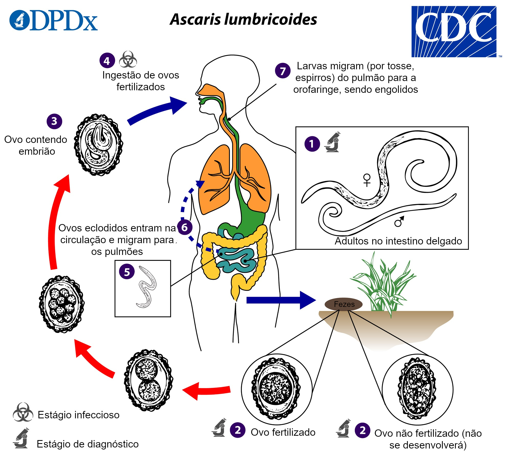

# Projeto Nematoda: Vida e Impacto

Este projeto tem como **objetivo** criar um produto digital educativo sobre o **Filo Nematoda**. O site apresenta, de forma organizada e acessível, informações essenciais sobre a diversidade, morfologia, ciclo de vida, doenças associadas e formas de prevenção.

## Sobre o Filo Nematoda
Os nematódeos são vermes cilíndricos alongados com simetria bilateral e cutícula resistente. Habitam praticamente todos os ambientes da Terra, com milhares de espécies descritas — de vida livre (papel ecológico) a parasitas de plantas e animais.

A espécie *Ascaris lumbricoides* (lombriga) apresenta **dimorfismo sexual** (machos menores e com extremidade posterior curvada; fêmeas maiores e com extremidade reta). Os nematódeos possuem **sistema digestório completo** (boca e ânus) e **sistema reprodutor** desenvolvido.

## Doenças causadas por nematódeos

### Ascaridíase
Infecção por *Ascaris lumbricoides*. Ocorre pela ingestão de ovos em água/alimentos contaminados.  

### Ancilostomíase (amarelão)
Causada por *Ancylostoma duodenale* e *Necator americanus*. As larvas no solo **penetram pela pele** (geralmente pés descalços), migram e retornam ao intestino.  

### Larva migrans cutânea
Larvas de nematódeos de **cães e gatos** infectam acidentalmente a pele humana, causando lesões serpiginosas (o parasita **não completa** o ciclo em humanos).  

### Filariose (elefantíase)
Transmitida por **mosquitos**; *Wuchereria bancrofti* se instala nos **vasos linfáticos**, podendo causar **linfedema crônico** (elefantíase).  

### Oxiurose (enterobiose)
Causada por *Enterobius vermicularis*. Ovos são ingeridos/inalados; fêmeas gravídicas migram à **região perianal** à noite para oviposição (prurido).  

## Prevenção e controle
- **Saneamento básico**: água potável, coleta e tratamento de esgoto  
- **Higiene** pessoal e de alimentos  
- **Uso de calçados** (evita penetração de larvas no solo)  
- **Vermifugação** de cães e gatos (larva migrans)  
- **Desparasitação em massa** e **educação sanitária** em áreas endêmicas

## Créditos de imagens
- `archives/ascaridiase.jpg` – ciclo de *Ascaris* (material educativo CDC/DPDx).  
- `archives/Ancilostom%C3%ADase.png` – ciclo de ancilostomíase (material educativo).  
- `archives/larva-migrans-ciclo.jpg` – adaptado de CDC/DPDx (larva migrans).  
- `archives/vidafilaria.jpg` – ciclo de filariose (material educativo).  
- `archives/oxiurosecicloeditavel-cke.jpg` – ciclo de oxiurose (material educativo).  
- `archives/morfologia.jpg` – dimorfismo sexual em *Ascaris*.  
- `archives/SaneamentoBasico.png` – infográfico de saneamento básico.
**Referências bibliográficas:**
- BRUSCA, R. C.; BRUSCA, G. J. 2 ed. Invertebrates. Sinauer.
- MALAKOV, V. V. Nematodes: structure, development, classification and phylogeny, 1994.
- BRUMAN, J. Principles of Nematology.

> Observação: algumas figuras derivam de materiais do **CDC/DPDx** e de portais educativos (ex.: MD.Saúde). Quando aplicável, mantenha a atribuição e os termos de uso originais.

